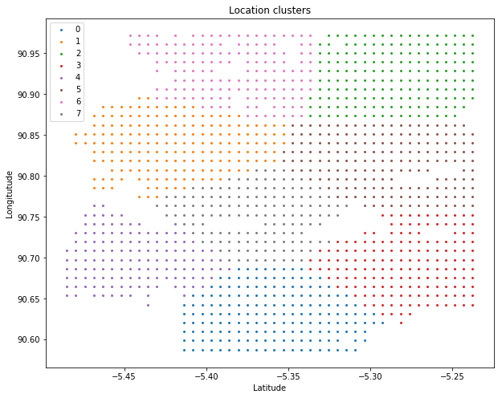

# 2 - Data analysis and feature engineering

## Description

The main objective of data preprocessing here is to create a more structured
dataset that contains only the tavel demand values for training and evaluation of the proposed model.

More specifically, we try to achieve two things in the preprocessed data:

1. Rows in the preprocessed data should be arranged in time order 
and each column corresponds to a unique geohash location. 

2. Identify clusters of locations and index the columns of the preprocessed data according to the 
clusters' labels.

The details of the proprocessing steps can be found in this [ipython notebook](https://github.com/Tanmengxuan/grab_traffic_management/blob/master/2_Data_Analysis/traffic_analysis.ipynb).

## 1_Row order in prepocessed data

The rows in the prepocessed data is arranged in increasing time order.
For instance the first row contains demands from all 1329 locations at day 1 time 0:0 (1,0:0),
the second row contains demands from the same 1329 locations at day 1 time 0:15 (1,0:15), and so on.

Since the training data contains 61 days of the data at 15 minutes intervals, the total number of rows in
the prepocessed training data is 5856. The final shape of the prepocessed training data is (5856, 1329). 

## 2_Column order in prepocessed data

We first decode all unique geohashes into their respective latitude and longitude values. Then, possible clusters of locations are identified using the KMeans clustering algorithm. 
The algorithm makes use of relative distances between locations to form different clusters.

8 clusters have been identified. Next, the columns of the preprocessed data are being arranged such that locations with the same cluster label are grouped together.

The arrangement of the columns in the preprocessed data has been saved in `geohash_8c.json` in the `../processed_data` folder and will be used for training 
and evaluation of the multiple ARNN model where each ARNN will be assigned to model and predict travel demands in different clusters.

## Travel demand patterns 

The travel demand patterns of locations are generally different across different clusters. Hence, using 
different ARNN models to capture patterns in different clusters may help in the forecasting accuracy.

We randomly picked 2 locations from 4 different clusters for display.
