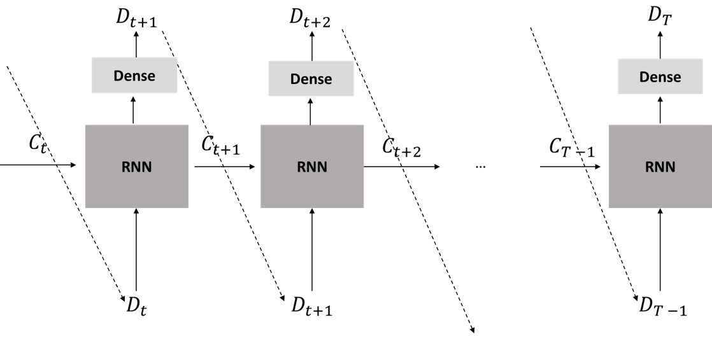

# grab_traffic_management

An attempt to tackle the [Traffic Management](https://www.aiforsea.com/traffic-management) 
problem as part of the [Grab AI for S.E.A. challenge](https://www.aiforsea.com/).

Thank you for visiting this repo. Any feedback is appreciated! 

**Content**

1. [Model description](https://github.com/Tanmengxuan/grab_traffic_management/tree/master/1_Model_Description)- A description of the architecture of the model
2. [Data analysis and feature engineering](https://github.com/Tanmengxuan/grab_traffic_management/tree/master/2_Data_Analysis) - How the raw data is being processed to train and evaluate the model 
3. [Guide to running the code](https://github.com/Tanmengxuan/grab_traffic_management/tree/master/3_Main)- A step-by-step guide to running the code and software packages requirement

## Brief overview of proposed solution

We proposed to use a Recurrent Neural Network (RNN) with autoregressive property to model the spatio-temporal travel 
demand patterns of users.

The model makes use of history demand information to predict future demand at every timestep.

The model is able to predict the future demand of any time length given a sequence of input of arbitrary length T.  

The plot displays that model's ability to capture the demand pattern of users at location 'qp09eq' 100 time intervals ahead
when given a input sequence of length 300.

More details can be found in [1_Model_Description](https://github.com/Tanmengxuan/grab_traffic_management/tree/master/1_Model_Description) and [2_Data_Analysis](https://github.com/Tanmengxuan/grab_traffic_management/tree/master/2_Data_Analysis).
